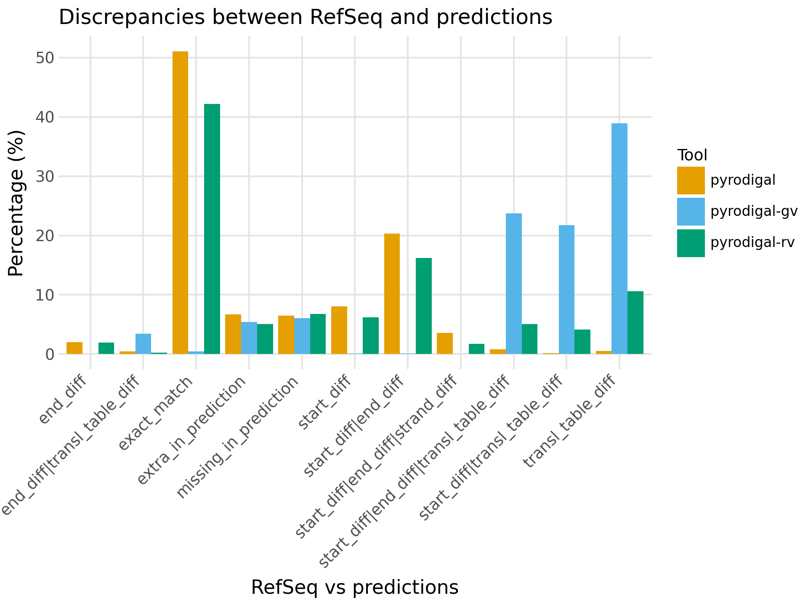

# 🔥🦠 Pyrodigal-rv [](https://github.com/LanderDC/pyrodigal-rv/stargazers)

*A [Pyrodigal](https://github.com/althonos/pyrodigal) extension to predict genes in RNA viruses (with standard and alternative genetic code).*

[](https://github.com/LanderDC/pyrodigal-rv/actions)
[](https://choosealicense.com/licenses/gpl-3.0/)
[](https://pypi.org/project/pyrodigal-rv)
[](https://anaconda.org/bioconda/pyrodigal-rv)
[](https://pypi.org/project/pyrodigal-rv/#files)
[](https://pypi.org/project/pyrodigal/#files)
[](https://pypi.org/project/pyrodigal-rv/#files)
[](https://github.com/LanderDC/pyrodigal-rv/)
[](https://github.com/LanderDC/pyrodigal-rv/issues)
[](https://github.com/LanderDC/pyrodigal-rv/blob/main/CHANGELOG.md)
[](https://pepy.tech/project/pyrodigal-rv)


## 🗺️ Overview

[Pyrodigal](https://github.com/althonos/pyrodigal) is a Python module that provides 
[Cython](https://cython.org/) bindings to [Prodigal](https://github.com/hyattpd/Prodigal/), 
an efficient gene finding method for genomes and metagenomes based on dynamic programming.
Additionally, `pyrodigal-gv` is a small extension module for pyrodigal (both written by [Martin Larralde](https://github.com/althonos)) which distributes additional metagenomic models for giant viruses and viruses that use alternative genetic codes, first provided by [Antônio Camargo](https://github.com/apcamargo) in [prodigal-gv](https://github.com/apcamargo/prodigal-gv). 

Inspired by the additional metagenomic models for giant viruses and bacteriophages in [`pyrodigal-gv`](https://github.com/althonos/pyrodigal-gv), `pyrodigal-rv` substitutes those metagenomic models and the bacterial models from `pyrodigal` for metagenomic models from RNA viruses which mostly use the standard genetic code (translation table 1), but also include RNA virus models with alternative genetic codes.

See [below](#models) for which viral families and which genetic codes are included. The process of model generation is documented in a [separate repo](https://github.com/LanderDC/add_pyrodigal_rv_models).

*Code and instructions below are exactly the same as for `pyrodigal-gv`.*

## 🔧 Installing

`pyrodigal-rv` can be installed directly from [PyPI](https://pypi.org/project/pyrodigal-rv/)
as a universal wheel that contains all required data files:
```console
$ pip install pyrodigal-rv
```

<!--
Otherwise, `pyrodigal-gv` is also available as a [Bioconda](https://bioconda.github.io/)
package:
```console
$ conda install -c bioconda pyrodigal-gv
``` -->

## 💡 Example

Just use the provided `ViralGeneFinder` class instead of the usual `GeneFinder`
from `pyrodigal`, and the new viral models will be used automatically in
*meta* mode:

```python
import Bio.SeqIO
import pyrodigal_rv

record = Bio.SeqIO.read("sequence.gbk", "genbank")

orf_finder = pyrodigal_rv.ViralGeneFinder(meta=True)
for i, pred in enumerate(orf_finder.find_genes(bytes(record.seq))):
    print(f">{record.id}_{i+1}")
    print(pred.translate())
```

`ViralGeneFinder` has an additional keyword argument, `viral_only`, which can
be set to `True` to run gene calling using only viral models.

## 🔨 Command line

`pyrodigal-rv` comes with a very simple command line similar to Prodigal and `pyrodigal`:
```console
$ pyrodigal-rv -i <input_file.fasta> -a <gene_translations.fasta> -d <gene_sequences.fasta>
```

*Contrary to `prodigal` and `pyrodigal`, the `pyrodigal-rv` script runs in **meta** mode
by default! Running in **single** mode can be done with `pyrodigal-rv -p single` but 
the results will be exactly the same as `pyrodigal`, so why would you ever do this ⁉️*

## 📊 Benchmarking

The benchmarking is documented in [this repo](https://github.com/LanderDC/add_pyrodigal_rv_models).

### Accuracy

To evaluate `pyrodigal-rv` ORF prediction in RNA viruses, all *Riboviria* sequences in RefSeq indicated as "complete" by the sequence submission authors and without N's in the sequence were used as a benchmark (*n=9,001*).

All tools were run in closed mode (`-c`) and `pyrodigal` was forced to use genetic code 1 (`-g 1`) for the benchmarking as this is the most used genetic code by RNA viruses. 
After comparison with the CDS annotations from RefSeq `pyrodigal` and `pyrodigal-rv` give 58.9% and 49.4% exact matches respectively, while both of them also predicted ~25% CDSs with different start and/or stop sites compared to RefSeq. 
For `pyrodigal-rv` another 12.4% was predicted to only have a different translation table.

As expected `pyrodigal-gv` had almost no exact matches because it contains no metagenomic models with genetic code 1, and it also predicts 28.8% CDSs with different start/stop sites (4.6% higher than `pyrodigal-rv`).

`pyrodigal-rv` also performed best in context of extra and missing CDS predictions (considerably lower amount extra predictions and only 0.4% more missing predictions compared to `pyrodigal`).

<p align="center">
  
</p>

`pyrodigal-rv` adds the ability to predict the right genetic code for your RNA virus sequence, when comparing to RefSeq, 11.7% of the sequences had a mismatch in genetic code. 
However, when examining more closely the majority of these sequences belong to the *Atkinsviridae*, *Blumeviridae*, *Fiersviridae*, *Solspiviridae* and *Steitzviridae*, which are RNA phages and should use the bacterial genetic code 11 (as predicted by `pyrodigal-rv`). 
This shows that not all sequences in RefSeq are annotated with the correct translation table and this benchmark underestimated `pyrodigal-rv`'s accuracy in number of exact matches. 

<p align="left">
  
</p>

<p align="center">
  
</p>

**Disclaimer:** The training models for `pyrodigal-rv` contain some RefSeq sequences.

### Speed

CLI speed was benchmarked with [hyperfine](https://github.com/sharkdp/hyperfine) over 10 runs of the same command on 9,000 sequences for each CLI ([`pyrodigal`](https://github.com/althonos/pyrodigal), [`pyrodigal-gv`](https://github.com/althonos/pyrodigal-gv) and `pyrodigal-rv`) using 10 processes (`-j 10 --pool process`). 

| Command | Mean [s] | Min [s] | Max [s] | Relative |
|:---|---:|---:|---:|---:|
| `pyrodigal` | 63.883 ± 0.597 | 63.402 | 65.288 | 2.19 ± 0.03 |
| `pyrodigal-gv` | 29.568 ± 0.563 | 28.250 | 30.286 | 1.01 ± 0.02 |
| `pyrodigal-rv` | 29.150 ± 0.199 | 28.860 | 29.540 | 1.00 |

## 🔖 Citation

Pyrodigal is scientific software, with a
[published paper](https://doi.org/10.21105/joss.04296)
in the [Journal of Open-Source Software](https://joss.theoj.org/). Please
cite both [Pyrodigal](https://doi.org/10.21105/joss.04296)
and [Prodigal](https://doi.org/10.1186/1471-2105-11-119) if you are using it in
an academic work, for instance as:

> Pyrodigal (Larralde, 2022), a Python library binding to Prodigal (Hyatt *et al.*, 2010).

Detailed references are available on the [Publications page](https://pyrodigal.readthedocs.io/en/stable/publications.html) of the
[online documentation](https://pyrodigal.readthedocs.io/).


## 💭 Feedback

### ⚠️ Issue Tracker

Found a bug ? Have an enhancement request ? Head over to the [GitHub issue
tracker](https://github.com/althonos/pyrodigal-gv/issues) if you need to report
or ask something. If you are filing in on a bug, please include as much
information as you can about the issue, and try to recreate the same bug
in a simple, easily reproducible situation.

### 🏗️ Contributing

Contributions are more than welcome! See
[`CONTRIBUTING.md`](https://github.com/althonos/pyrodigal-rv/blob/main/CONTRIBUTING.md)
for more details.

## 📋 Changelog

This project adheres to [Semantic Versioning](http://semver.org/spec/v2.0.0.html)
and provides a [changelog](https://github.com/LanderDC/pyrodigal-rv/blob/main/CHANGELOG.md)
in the [Keep a Changelog](http://keepachangelog.com/en/1.0.0/) format.


## ⚖️ License

This library is provided under the [GNU General Public License v3.0](https://choosealicense.com/licenses/gpl-3.0/).
The Prodigal code was written by [Doug Hyatt](https://github.com/hyattpd) and is distributed under the
terms of the GPLv3 as well. See `vendor/Prodigal/LICENSE` for more information.

*This project is in no way affiliated, sponsored, or otherwise endorsed
by the [original Prodigal authors](https://github.com/hyattpd). It was developed
by [Martin Larralde](https://github.com/althonos/) during his PhD project
at the [European Molecular Biology Laboratory](https://www.embl.de/) in
the [Zeller team](https://github.com/zellerlab). RNA virus models were added by
[Lander De Coninck](https://github.com/LanderDC/).*


## 📐 Models
<details><summary>Click to see included models and genetic codes:</summary> 
<table>
 <thead>
  <tr>
   <th>model</th>
   <th>parent_family</th>
   <th>name</th>
   <th>viral</th>
   <th>gc_content</th>
   <th>genetic_code</th>
   <th>uses_sd</th>
  </tr>
 </thead>
 <tbody>
  <tr>
   <td>1</td>
   <td></td>
   <td>Tymoviridae_1_model</td>
   <td>V</td>
   <td>54.5</td>
   <td>1</td>
   <td>0</td>
  </tr>
  <tr>
   <td>2</td>
   <td></td>
   <td>Picobirnaviridae_6_model</td>
   <td>V</td>
   <td>43.5</td>
   <td>6</td>
   <td>0</td>
  </tr>
  <tr>
   <td>3</td>
   <td></td>
   <td>Polymycoviridae_1_model</td>
   <td>V</td>
   <td>57.7</td>
   <td>1</td>
   <td>0</td>
  </tr>
  <tr>
   <td>4</td>
   <td></td>
   <td>Atkinsviridae_11_model</td>
   <td>V</td>
   <td>49.0</td>
   <td>11</td>
   <td>1</td>
  </tr>
  <tr>
   <td>5</td>
   <td></td>
   <td>Duinviridae_11_model</td>
   <td>V</td>
   <td>43.6</td>
   <td>11</td>
   <td>1</td>
  </tr>
  <tr>
   <td>6</td>
   <td></td>
   <td>Aspiviridae_1_model</td>
   <td>V</td>
   <td>36.0</td>
   <td>1</td>
   <td>0</td>
  </tr>
  <tr>
   <td>7</td>
   <td></td>
   <td>Narnaviridae_1_model</td>
   <td>V</td>
   <td>50.5</td>
   <td>1</td>
   <td>0</td>
  </tr>
  <tr>
   <td>8</td>
   <td></td>
   <td>Peribunyaviridae_1_model</td>
   <td>V</td>
   <td>35.9</td>
   <td>1</td>
   <td>0</td>
  </tr>
  <tr>
   <td>9</td>
   <td></td>
   <td>Nodaviridae_1_model</td>
   <td>V</td>
   <td>49.5</td>
   <td>1</td>
   <td>0</td>
  </tr>
  <tr>
   <td>10</td>
   <td></td>
   <td>Sedoreoviridae_1_model</td>
   <td>V</td>
   <td>37.6</td>
   <td>1</td>
   <td>0</td>
  </tr>
  <tr>
   <td>11</td>
   <td></td>
   <td>Narnaviridae_6_model</td>
   <td>V</td>
   <td>51.3</td>
   <td>6</td>
   <td>0</td>
  </tr>
  <tr>
   <td>12</td>
   <td></td>
   <td>Qinviridae_1_model</td>
   <td>V</td>
   <td>46.6</td>
   <td>1</td>
   <td>0</td>
  </tr>
  <tr>
   <td>13</td>
   <td></td>
   <td>Narnaviridae_4_model</td>
   <td>V</td>
   <td>41.3</td>
   <td>4</td>
   <td>1</td>
  </tr>
  <tr>
   <td>14</td>
   <td></td>
   <td>Tombusviridae_6_model</td>
   <td>V</td>
   <td>51.5</td>
   <td>6</td>
   <td>1</td>
  </tr>
  <tr>
   <td>15</td>
   <td></td>
   <td>Orthototiviridae_1_model</td>
   <td>V</td>
   <td>48.3</td>
   <td>1</td>
   <td>0</td>
  </tr>
  <tr>
   <td>16</td>
   <td></td>
   <td>Tombusviridae_16_model</td>
   <td>V</td>
   <td>53.1</td>
   <td>16</td>
   <td>1</td>
  </tr>
  <tr>
   <td>17</td>
   <td></td>
   <td>Carmotetraviridae_1_model</td>
   <td>V</td>
   <td>50.7</td>
   <td>1</td>
   <td>0</td>
  </tr>
  <tr>
   <td>18</td>
   <td></td>
   <td>Steitzviridae_11_model</td>
   <td>V</td>
   <td>50.4</td>
   <td>11</td>
   <td>1</td>
  </tr>
  <tr>
   <td>19</td>
   <td></td>
   <td>Picobirnaviridae_1_model</td>
   <td>V</td>
   <td>42.0</td>
   <td>1</td>
   <td>1</td>
  </tr>
  <tr>
   <td>20</td>
   <td></td>
   <td>Dicistroviridae_1_model</td>
   <td>V</td>
   <td>40.7</td>
   <td>1</td>
   <td>0</td>
  </tr>
  <tr>
   <td>21</td>
   <td></td>
   <td>Astroviridae_1_model</td>
   <td>V</td>
   <td>45.9</td>
   <td>1</td>
   <td>0</td>
  </tr>
  <tr>
   <td>22</td>
   <td></td>
   <td>Hepadnaviridae_1_model</td>
   <td>V</td>
   <td>47.4</td>
   <td>1</td>
   <td>0</td>
  </tr>
  <tr>
   <td>23</td>
   <td></td>
   <td>Tombusviridae_1_model</td>
   <td>V</td>
   <td>49.8</td>
   <td>1</td>
   <td>0</td>
  </tr>
  <tr>
   <td>24</td>
   <td></td>
   <td>Solspiviridae_11_model</td>
   <td>V</td>
   <td>49.9</td>
   <td>11</td>
   <td>1</td>
  </tr>
  <tr>
   <td>25</td>
   <td></td>
   <td>Cystoviridae_11_model</td>
   <td>V</td>
   <td>51.3</td>
   <td>11</td>
   <td>1</td>
  </tr>
  <tr>
   <td>26</td>
   <td></td>
   <td>Picobirnaviridae_5_model</td>
   <td>V</td>
   <td>36.2</td>
   <td>5</td>
   <td>0</td>
  </tr>
  <tr>
   <td>27</td>
   <td></td>
   <td>Blumeviridae_11_model</td>
   <td>V</td>
   <td>45.2</td>
   <td>11</td>
   <td>1</td>
  </tr>
  <tr>
   <td>28</td>
   <td></td>
   <td>Alphaormycoviridae_1_model</td>
   <td>V</td>
   <td>44.6</td>
   <td>1</td>
   <td>0</td>
  </tr>
  <tr>
   <td>29</td>
   <td></td>
   <td>Orthomyxoviridae_1_model</td>
   <td>V</td>
   <td>40.0</td>
   <td>1</td>
   <td>0</td>
  </tr>
  <tr>
   <td>30</td>
   <td></td>
   <td>Fiersviridae_4_model</td>
   <td>V</td>
   <td>49.2</td>
   <td>4</td>
   <td>1</td>
  </tr>
  <tr>
   <td>31</td>
   <td></td>
   <td>Flaviviridae_1_model</td>
   <td>V</td>
   <td>42.1</td>
   <td>1</td>
   <td>0</td>
  </tr>
  <tr>
   <td>32</td>
   <td></td>
   <td>Splipalmiviridae_1_model</td>
   <td>V</td>
   <td>49.3</td>
   <td>1</td>
   <td>0</td>
  </tr>
  <tr>
   <td>33</td>
   <td></td>
   <td>Picobirnaviridae_4_model</td>
   <td>V</td>
   <td>43.0</td>
   <td>4</td>
   <td>0</td>
  </tr>
  <tr>
   <td>34</td>
   <td></td>
   <td>Betaormycoviridae_1_model</td>
   <td>V</td>
   <td>41.6</td>
   <td>1</td>
   <td>0</td>
  </tr>
  <tr>
   <td>35</td>
   <td></td>
   <td>Tombusviridae_4_model</td>
   <td>V</td>
   <td>48.4</td>
   <td>4</td>
   <td>0</td>
  </tr>
  <tr>
   <td>36</td>
   <td></td>
   <td>Pseudototiviridae_1_model</td>
   <td>V</td>
   <td>55.2</td>
   <td>1</td>
   <td>0</td>
  </tr>
  <tr>
   <td>37</td>
   <td></td>
   <td>Fiersviridae_6_model</td>
   <td>V</td>
   <td>48.7</td>
   <td>6</td>
   <td>0</td>
  </tr>
  <tr>
   <td>38</td>
   <td></td>
   <td>Fimoviridae_1_model</td>
   <td>V</td>
   <td>31.0</td>
   <td>1</td>
   <td>0</td>
  </tr>
  <tr>
   <td>39</td>
   <td></td>
   <td>Botourmiaviridae_4_model</td>
   <td>V</td>
   <td>44.8</td>
   <td>4</td>
   <td>1</td>
  </tr>
  <tr>
   <td>40</td>
   <td></td>
   <td>Fiersviridae_11_model</td>
   <td>V</td>
   <td>50.1</td>
   <td>11</td>
   <td>1</td>
  </tr>
  <tr>
   <td>41</td>
   <td></td>
   <td>Yueviridae_1_model</td>
   <td>V</td>
   <td>41.3</td>
   <td>1</td>
   <td>0</td>
  </tr>
  <tr>
   <td>42</td>
   <td></td>
   <td>Dicistroviridae_6_model</td>
   <td>V</td>
   <td>35.9</td>
   <td>6</td>
   <td>1</td>
  </tr>
  <tr>
   <td>43</td>
   <td></td>
   <td>Spinareoviridae_1_model</td>
   <td>V</td>
   <td>43.6</td>
   <td>1</td>
   <td>0</td>
  </tr>
  <tr>
   <td>44</td>
   <td></td>
   <td>Matonaviridae_1_model</td>
   <td>V</td>
   <td>61.3</td>
   <td>1</td>
   <td>0</td>
  </tr>
  <tr>
   <td>45</td>
   <td></td>
   <td>Picornaviridae_1_model</td>
   <td>V</td>
   <td>44.2</td>
   <td>1</td>
   <td>0</td>
  </tr>
  <tr>
   <td>46</td>
   <td></td>
   <td>Caulimoviridae_1_model</td>
   <td>V</td>
   <td>40.7</td>
   <td>1</td>
   <td>0</td>
  </tr>
  <tr>
   <td>47</td>
   <td></td>
   <td>Barnaviridae_1_model</td>
   <td>V</td>
   <td>50.7</td>
   <td>1</td>
   <td>0</td>
  </tr>
  <tr>
   <td>48</td>
   <td></td>
   <td>Chrysoviridae_1_model</td>
   <td>V</td>
   <td>49.1</td>
   <td>1</td>
   <td>0</td>
  </tr>
  <tr>
   <td>49</td>
   <td></td>
   <td>Mitoviridae_16_model</td>
   <td>V</td>
   <td>44.1</td>
   <td>16</td>
   <td>0</td>
  </tr>
  <tr>
   <td>50</td>
   <td></td>
   <td>Picornaviridae_4_model</td>
   <td>V</td>
   <td>48.3</td>
   <td>4</td>
   <td>0</td>
  </tr>
  <tr>
   <td>51</td>
   <td></td>
   <td>Picornaviridae_6_model</td>
   <td>V</td>
   <td>43.0</td>
   <td>6</td>
   <td>0</td>
  </tr>
  <tr>
   <td>52</td>
   <td></td>
   <td>Partitiviridae_1_model</td>
   <td>V</td>
   <td>44.9</td>
   <td>1</td>
   <td>0</td>
  </tr>
  <tr>
   <td>53</td>
   <td></td>
   <td>Qinviridae_6_model</td>
   <td>V</td>
   <td>47.8</td>
   <td>6</td>
   <td>1</td>
  </tr>
  <tr>
   <td>54</td>
   <td></td>
   <td>Botourmiaviridae_1_model</td>
   <td>V</td>
   <td>51.6</td>
   <td>1</td>
   <td>0</td>
  </tr>
  <tr>
   <td>55</td>
   <td></td>
   <td>Potyviridae_1_model</td>
   <td>V</td>
   <td>41.9</td>
   <td>1</td>
   <td>0</td>
  </tr>
  <tr>
   <td>56</td>
   <td></td>
   <td>Fiersviridae_16_model</td>
   <td>V</td>
   <td>50.0</td>
   <td>16</td>
   <td>0</td>
  </tr>
  <tr>
   <td>57</td>
   <td></td>
   <td>Yadokariviridae_1_model</td>
   <td>V</td>
   <td>45.6</td>
   <td>1</td>
   <td>0</td>
  </tr>
  <tr>
   <td>58</td>
   <td></td>
   <td>Narnaviridae_16_model</td>
   <td>V</td>
   <td>45.3</td>
   <td>16</td>
   <td>1</td>
  </tr>
  <tr>
   <td>59</td>
   <td>Flaviviridae</td>
   <td>Pestivirus_1_model</td>
   <td>V</td>
   <td>45.0</td>
   <td>1</td>
   <td>0</td>
  </tr>
  <tr>
   <td>60</td>
   <td>Flaviviridae</td>
   <td>Pegivirus_1_model</td>
   <td>V</td>
   <td>55.2</td>
   <td>1</td>
   <td>0</td>
  </tr>
  <tr>
   <td>61</td>
   <td>Mitoviridae</td>
   <td>Unuamitovirus_4_model</td>
   <td>V</td>
   <td>35.9</td>
   <td>4</td>
   <td>0</td>
  </tr>
  <tr>
   <td>62</td>
   <td>Flaviviridae</td>
   <td>Hepacivirus_1_model</td>
   <td>V</td>
   <td>55.0</td>
   <td>1</td>
   <td>0</td>
  </tr>
  <tr>
   <td>63</td>
   <td>Mitoviridae</td>
   <td>Duamitovirus_4_model</td>
   <td>V</td>
   <td>41.4</td>
   <td>4</td>
   <td>0</td>
  </tr>
  <tr>
   <td>64</td>
   <td>Mitoviridae</td>
   <td>Triamitovirus_4_model</td>
   <td>V</td>
   <td>39.9</td>
   <td>4</td>
   <td>0</td>
  </tr>
 </tbody>
</table>
</details>
<br>